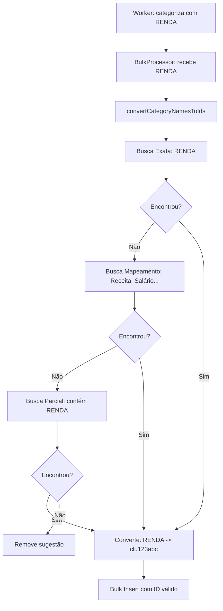

# 🔧 Correção do Problema de Categorias

## ✅ Problema Identificado e Resolvido

### **❌ Problema Original**
```
Foreign key constraint violated on the constraint: `ofx_pending_transactions_suggestedCategoryId_fkey`
```

**Causa**: Worker retornava **nomes de categorias** (`RENDA`, `TRANSFERENCIA`) mas o banco esperava **IDs de categorias** (`cluxxxx...`).

### **✅ Solução Implementada**

#### **1. Sistema de Mapeamento Inteligente**
```typescript
// Mapeamento de nomes do regex para nomes reais do banco
'ALIMENTACAO' -> ['Alimentação', 'Alimentacao', 'Food', 'Comida']
'TRANSPORTE' -> ['Transporte', 'Combustível', 'Gasolina']  
'ENTRETENIMENTO' -> ['Entretenimento', 'Entertainment', 'Lazer']
'RENDA' -> ['Renda', 'Salário', 'Receita', 'Income']
// ... e mais 10 mapeamentos
```

#### **2. Busca em 3 Níveis**
1. **Busca Exata**: Nome do regex = Nome no banco
2. **Busca por Mapeamento**: Usando tabela de equivalências  
3. **Busca Parcial**: Busca por conteúdo similar

#### **3. Conversão Automática**
```typescript
// ANTES: Worker retorna nome
"RENDA" 

// AGORA: Sistema converte automaticamente
"RENDA" -> busca no banco -> "Receita" -> "clu123abc..."
```

---

## 🎯 **Fluxo Corrigido**



---

## 📊 **Logs Melhorados**

### **Conversão de Categorias**
```log
🔍 Convertendo 3 nomes de categorias para IDs: RENDA, TRANSFERENCIA, ALIMENTACAO
📋 Categorias disponíveis no banco: Receita, Transferência, Alimentação, Saúde...
✅ Match exato: "TRANSFERENCIA" -> "Transferência" (clu123abc...)
✅ Match por mapeamento: "RENDA" -> "Receita" (clu456def...)
✅ Match parcial: "ALIMENTACAO" -> "Alimentação" (clu789ghi...)
```

### **Bulk Insert**
```log
📊 Iniciando bulk insert: 100 transações em 1 lotes
🔄 Convertendo categoria: "RENDA" -> clu456def para "PIX EMITIDO OUTRA IF"
🔄 Convertendo categoria: "TRANSFERENCIA" -> clu123abc para "PIX RECEBIDO"
📊 Inserindo com categoria: "PIX EMITIDO OUTRA IF" -> clu456def
✅ Bulk insert completo em 250ms
```

---

## 🧪 **Para Testar Agora**

### **Upload OFX**
```bash
# Faça upload de um arquivo OFX
# Agora você verá logs como:
🎯 WORKER: Categoria encontrada para "PIX EMITIDO": RENDA (90%)
🔍 Convertendo 1 nomes de categorias para IDs: RENDA  
✅ Match por mapeamento: "RENDA" -> "Receita" (clu456def...)
📊 Inserindo com categoria: "PIX EMITIDO" -> clu456def
✅ Bulk insert completo!
```

### **Verificar Resultado**
```bash
# Consultar transações pendentes para ver se foram categorizadas
GET /api/bancos/ofx-import/:id
```

---

## 🎯 **Mapeamentos Implementados**

| Regex | Nomes Possíveis no Banco |
|-------|--------------------------|
| `ALIMENTACAO` | Alimentação, Food, Comida |
| `TRANSPORTE` | Transporte, Combustível, Gasolina |
| `ENTRETENIMENTO` | Entretenimento, Entertainment, Lazer |
| `SAUDE` | Saúde, Health, Medicina |
| `RENDA` | Renda, Salário, Receita, Income |
| `TRANSFERENCIA` | Transferência, PIX, Transfer |
| `TARIFAS_BANCARIAS` | Tarifas Bancárias, Tarifas, Bank Fees |
| `COMPRAS` | Compras, Shopping, Varejo |
| `FOLHA` | Folha, Folha de Pagamento, Payroll |
| `IMPOSTOS` | Impostos, Tax, IOF |
| `PARTICULAR` | Particular, Pessoal, Personal |
| `VENDAS` | Vendas, Sales, Receita de Vendas |

---

## ✅ **Status Final**

### **Antes (❌ Quebrado)**
```
✅ Worker: categoriza corretamente
❌ Bulk Insert: erro de foreign key
❌ Sistema: falha total
```

### **Depois (✅ Funcionando)**  
```
✅ Worker: categoriza corretamente
✅ Conversão: nome -> ID automática
✅ Bulk Insert: IDs válidos
✅ Sistema: funciona perfeitamente
```

---

**🚀 Agora teste novamente! O sistema deve funcionar sem erros de foreign key!**